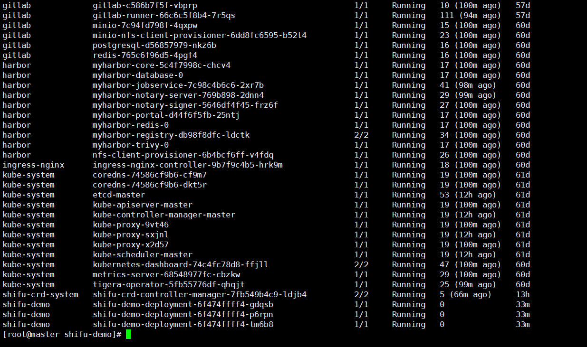

# 学习并测试开源物联网开发框架——Shifu

***Shifu***一名来源于中文“师父”。**师者，所以传道受业解惑也**。作为下一代开源物联网开发框架，***Shifu*** 实现了对物联网设备的高度控制，并成功以API的形式将这样的能力传授给开发者。这样一来，传统的物联网应用开发就被简化为简单的网络开发，从而大大提高了物联网应用开发的效率、质量和复用性。


本开源项目目标是快速体验并简单编写一个go应用来实现一个获取数据接口


## 0.快速安装并上手体验

我们可以在本地环境轻松安装并运行运行demo去体验

参考[***Shifu***官网【demo】安装说明](https://shifu.dev/zh-Hans/docs/tutorials/demo-install)

这里我们使用VMware去安装Linux环境去部署


### 0.0 安装Docker

如果你已经安装了，请跳转到下一步操作

官方文档教程：https://docs.docker.com/engine/install/centos/


1. 卸载原有的版本

   ~~~shell
    sudo yum remove docker \
                     docker-client \
                     docker-client-latest \
                     docker-common \
                     docker-latest \
                     docker-latest-logrotate \
                     docker-logrotate \
                     docker-engine
   ~~~

   

2. 安装 `yum-utils` 

   ~~~shell
   sudo yum install -y yum-utils
   ~~~

3. 添加阿里云镜像

   ~~~shell
   yum-config-manager --add-repo http://mirrors.aliyun.com/docker-ce/linux/centos/docker-ce.repo
   ~~~

4. 安装

   ~~~shell
   sudo yum install docker-ce docker-ce-cli containerd.io
   ~~~

5. 启动并加入开机启动

   ~~~shell
   sudo systemctl start docker
   
   sudo systemctl enable docker
   ~~~


### 0.1 下载demo并安装

确保docker正常启动并使用后，在终端输入

```shell
curl -sfL https://raw.githubusercontent.com/Edgenesis/shifu/main/test/scripts/shifu-demo-install.sh | sudo sh -
```

如果出现没有反应，可以试试

```shell
wget shifu-demo-install.sh https://raw.githubusercontent.com/Edgenesis/shifu/main/test/scripts/shifu-demo-install.sh
```

显如果我们因为代理的缘故无法下载到这个sh脚本，可以考虑本机开节点下载好后上传到我们的服务器中，这里也提供对应的sh脚本，创建粘进去执行就行再执行`sudo sh -`

```sh
#!/bin/sh
set -e
set -o noglob

# get info of System
setup_verify_os_and_arch() {
    OS=$(uname -s | tr "[:upper:]" "[:lower:]" ) 
    ARCH=$(uname -m)
    case $ARCH in
        amd64)
            ARCH=amd64
            ;;
        x86_64)
            ARCH=amd64
            ;;
        arm64)
            ARCH=arm64
            ;;
        aarch64)
            ARCH=arm64
            ;;
        arm*)
            ARCH=arm64
            ;;
        *)
            fatal "Unsupported architecture $ARCH"
    esac
}

setup_verify_os_and_arch

curl -LO https://demo.shifu.dev/demo-content/shifu_demo_aio_${OS}_${ARCH}.tar

rm -rf shifudemos && mkdir shifudemos

tar -xvf shifu_demo_aio_${OS}_${ARCH}.tar -C shifudemos 

cd shifudemos

chmod +x test/scripts/deviceshifu-demo-aio.sh && sudo ./test/scripts/deviceshifu-demo-aio.sh run_demo
```


如果出现下面的这种错误，那么你需要去升级你的内核了，参考附录：内核升级进行。


成功启动以后我们可以通过`kubectl get pods -A`看到我们的Shifu已经启动了。


我们可以来测试一下服务是否正常，我们需要启动一个 `nginx` 来和数字孪生设备 ***deviceShifu*** 交互

```shell
sudo kubectl run --image=nginx:1.21 nginx
# 这里启动一个酶标仪的数字孪生模拟接入
sudo kubectl apply -f run_dir/shifu/demo_device/edgedevice-plate-reader
sudo kubectl exec -it nginx -- bash
curl "deviceshifu-plate-reader.deviceshifu.svc.cluster.local/get_measurement"
```

我们就能看到对应设备返回的数据


**PS：**如果仍然不能正常运行（例如kind的版本问题，内核版本过低，windows端的docker desktop无法启动等等问题），而我们需要用到demo中提到的虚拟硬件，我们可以来看看这个`shifu-demo-install.sh`

我们可以单独下载这个tar，os为`linux`，ARCH固定为`amd64`

```shell
curl -LO https://demo.shifu.dev/demo-content/shifu_demo_aio_${OS}_${ARCH}.tar

rm -rf shifudemos && mkdir shifudemos
```

接着我们按照脚本下一步去解压这个tar，并来到`./test/scripts/deviceshifu-demo-aio.sh`，可以看到，我们想要的虚拟硬件文件就在`$RUN_DIR/$SHIFU_DIR/demo_device`下，其实就是k8s的yaml文件，我们**自己搭建好k8s集群和Shifu后**（如果不知道如何配置，请看附录：落地部署），再apply你所需的虚拟硬件的yaml即可。

```shell
tar -xvf shifu_demo_aio_${OS}_${ARCH}.tar -C shifudemos 

cd shifudemos

chmod +x test/scripts/deviceshifu-demo-aio.sh && sudo ./test/scripts/deviceshifu-demo-aio.sh run_demo
```


下面我采用的是落地部署中生产环境的部署


## 1.编写一个Go应用体验一下

项目目标：

运行一个酶标仪的数字孪生：https://shifu.dev/docs/tutorials/demo-try/#3-interact-with-the-microplate-reader

然后编写一个Go应用

1. 定期轮询获取酶标仪的/get_measurement接口，并将返回值平均后打印出来，轮询时间可自定义
2. Go的应用需要容器化
3. Go的应用需要运行在Shifu的k8s集群当中
4. 最终通过kubectl logs命令可以查看打印的值


### 1.0 配置外部访问

前面的快速安装和体验页面中我们借助内部nginx，并通过类似于`headless`方式使用service的域名访问pod服务，显然这个不太适合我们的这一节的调试，想要在外面本机访问这个pod，需要我们配置对应的ingress

**前置：**

- 安装Ingress Controller(参考前面提到语雀文档)

我们只需要`kubectl apply -f demo.yaml`

demo.yaml:

```shelll
apiVersion: networking.k8s.io/v1
kind: Ingress
metadata:
  name: ingress-http
  namespace: deviceshifu 
spec:
  ingressClassName: nginx
  rules:
  - host: deviceshifu-plate-reader.shifu.com # 自定义
    http:
      paths:
      - path: /
        pathType: Prefix
        backend:
          service:
            name: deviceshifu-plate-reader
            port:
              number: 80
```

通过SwitchHost或者直接修改windows的host文件，添加我们的域名解析

```shell
192.168.233.101 deviceshifu-plate-reader.shifu.com
```

然后我们就可以本机通过域名访问到


### 1.1 Go代码简析

代码结构如下

```tex
shifu-demo/
├── demo01/
│   └── config/
│   |   ├── config.go
│   |   └── model.go
|   └── etc/
│   |   └── config.toml
|   └── log/
│   |   ├── log.go
│   |   └── log_test.go
|   └── logic/
│   |   ├── measurement.go
│   |   └── measurement_test.go
|   └── task/
│   |   └── task.go
|   └── go.mod
│   |   └── go.sum
│   └── main.go
|
├── .gitlab-ci.yml
├── go.work
│   └── go.work.sum
├── Dockerfile
└── k8s-shifu.yaml
```


关于定时任务：我们可以简单封装一下`github.com/go-co-op/gocron`

```go
// Package task
// @Author twilikiss 2024/12/13 17:19:19
package task

import (
	"github.com/go-co-op/gocron"
	"shifu-demo/log"
	"shifu-demo/logic"
	"time"
)

type Task struct {
	s *gocron.Scheduler
}

func NewTask() *Task {
	return &Task{
		s: gocron.NewScheduler(time.UTC),
	}
}

// 这里我们可以传入分钟数（int类型）
func (t *Task) Run(url string, minute int) {
	t.s.Every(minute).Minute().Do(func() {
		result := logic.NewMeasurement().GetMeasurement(url)
		log.Info("get measurement avg: ", result)
	})
}

func (t *Task) StartBlocking() {
	t.s.StartBlocking()
}

func (t *Task) Stop() {
	t.s.Stop()
}
```

采用toml配置文件，可自定义配置url和轮询时间

```go
// Package config
// @Author twilikiss 2024/12/13 18:21:21
package config

import (
	"github.com/BurntSushi/toml"
	"os"
	"shifu-demo/log"
)

var Cfg *pollConfig

func init() {
	path := "../etc/config.toml"
	if !fileIsExist(path) {
		log.Error("配置文件不存在")
		panic("[etc\\config.toml]无法找到配置文件")
	}
	Cfg = new(pollConfig)
	_, err := toml.DecodeFile(path, &Cfg)
	if err != nil {
		log.Error("配置文件读取失败")
		panic("[etc\\config.toml]无法找到配置文件")
	}
}

func fileIsExist(filename string) bool {
	_, err := os.Stat(filename)
	return err == nil || os.IsExist(err)
}
```

```toml
[ServiceConfig]
# 这个url在测试时我们可以使用前面配置好的外部访问
# 当我们进行容器化部署时，改成service的域名访问即可
Url = "http://deviceshifu-plate-reader.deviceshifu.svc.cluster.local/get_measurement"
Time = "1" # 这里只能填入整数
```


同时为了保证数据准确性，浮点数计算采用了`math/big`包来处理

```go
	d1 := big.NewFloat(p_data)
	d2 := big.NewFloat(float64(count))
	result := new(big.Float)
	result.Quo(d1, d2)
	return result.String()
```


### 1.2 容器化部署

这里提供两个方式，一种就是比较简单的，将我们的代码提供docker打包成镜像，上传到阿里云容器镜像服务中（免费且更快），在配置对应的deployment类型的yaml即可。

Dockerfile:

```docker
# 使用阿里云的Golang镜像作为基础镜像，版本为1.22，并将此阶段命名为build-stage
FROM registry.cn-hangzhou.aliyuncs.com/twilikiss/golang:1.22 AS build-stage

# 设置工作目录为/app
WORKDIR /app

# 将当前目录下的所有文件复制到镜像中的/app目录
COPY . ./

# 设置Go环境变量GO111MODULE为on，启用模块支持
RUN go env -w GO111MODULE=on

# 设置Go模块代理为https://goproxy.cn和direct（直接访问），以加速模块下载
RUN go env -w GOPROXY=https://goproxy.cn,direct

# 下载项目依赖的Go模块
RUN go mod download

# 禁用CGO，设置目标操作系统为linux，并构建项目，输出可执行文件为/shifu-demo
RUN CGO_ENABLED=0 GOOS=linux go build  -o /shifu-demo demo01/main.go

# 使用阿里云的distroless_base-debian镜像作为基础镜像，版本为1.0，并将此阶段命名为build-release-stage
FROM registry.cn-hangzhou.aliyuncs.com/twilikiss/distroless_base-debian:1.0 AS build-release-stage

# 设置工作目录为根目录
WORKDIR /

# 从build-stage阶段复制构建好的可执行文件/shifu-demo到当前镜像的/shifu-demo位置
COPY --from=build-stage /shifu-demo /shifu-demo

# 从build-stage阶段复制配置文件/app/demo01/etc/config.toml到当前镜像的/etc/config.toml位置
COPY --from=build-stage /app/demo01/etc/config.toml /etc/config.toml

# 设置容器运行时的用户为非root用户nonroot
USER nonroot:nonroot

# 设置容器启动时执行的命令为/shifu-demo
ENTRYPOINT ["/shifu-demo"]
```


deployment.yaml:

```yaml
apiVersion: v1
kind: Namespace
metadata:
  name: shifu-demo

---

apiVersion: apps/v1
kind: Deployment
metadata:
  name: shifu-demo-deployment
  namespace: shifu-demo
  labels:
    app: shifu
spec:
  selector:
    matchLabels:
      app: shifu
  replicas: 3
  minReadySeconds: 5
  strategy:
    type: RollingUpdate
    rollingUpdate:
      maxSurge: 1
      maxUnavailable: 1
  template:
    metadata:
      labels:
        app: shifu
    spec:
      containers:
        - image: testharbor.com/shifu-demo/shifu-demo:{VERSION}
          name: shifu-demo
          imagePullPolicy: Always
          ports:
            - containerPort: 8083
              protocol: TCP
```


另外一种就是搭建CI\CD，关于如何搭建可以参考[我的语雀笔记](https://www.yuque.com/twilikiss/devops-study)

搭建成功后大体pod服务如下图所示：




再推送前先在harbor和gitlab中创建好我们的仓库


我们项目的CI\CD会去harbor拉取我们的镜像，请确保我们在containerd配置好了对应harbor的账户密码和镜像源

`/etc/containerd/config.toml`

```toml
      [plugins."io.containerd.grpc.v1.cri".registry.configs]

        [plugins."io.containerd.grpc.v1.cri".registry.configs."testharbor.com".tls]
          insecure_skip_verify = true
        [plugins."io.containerd.grpc.v1.cri".registry.configs."testharbor.com".auth]
          username = "devops"
          password = "填写你自己的密码即可"

      [plugins."io.containerd.grpc.v1.cri".registry.headers]

      [plugins."io.containerd.grpc.v1.cri".registry.mirrors]
        [plugins."io.containerd.grpc.v1.cri".registry.mirrors."docker.io"]
            endpoint = ["https://dockerpull.org","https://docker.m.daocloud.io"]

        [plugins."io.containerd.grpc.v1.cri".registry.mirrors."testharbor.com"]
          endpoint = ["https://testharbor.com"]
```


我们通过Goland或者git命令提示符设置对应的HTTP推送地址推送后即可在gitlab的pipeline页面看到我们的代码打包构建镜像和部署的过程。


我们可以看到，预设的（replicas: 3）3个pod服务就启动了


我们使用`sudo kubectl logs -f POD_NAME(填你自己的pod name) -n shifu-demo`就可以看到我们的服务成功跑起来并打印我们所需的数据：


## 附录

### 0.关于：升级内核

参考文章：yum安装：[Linux内核更新](https://blog.csdn.net/weixin_58410911/article/details/142882437?ops_request_misc=%257B%2522request%255Fid%2522%253A%252242381002ed8090bc0c8b7edd119bcfa3%2522%252C%2522scm%2522%253A%252220140713.130102334..%2522%257D&request_id=42381002ed8090bc0c8b7edd119bcfa3&biz_id=0&utm_medium=distribute.pc_search_result.none-task-blog-2~all~top_positive~default-1-142882437-null-null.142^v100^control&utm_term=centos7%E5%8D%87%E7%BA%A7%E5%86%85%E6%A0%B8%E7%89%88%E6%9C%AC&spm=1018.2226.3001.4187)

如果出现yum无法安装，尝试使用rpm文件手动安装

```shell
wget https://dl.lamp.sh/kernel/el7/kernel-ml-5.10.222-1.el7.x86_64.rpm
wget https://dl.lamp.sh/kernel/el7/kernel-ml-devel-5.10.222-1.el7.x86_64.rpm
```

如果虚拟机下不动，可以本机开代理下载下来然后上传到虚拟机

```shell
yum localinstall -y kernel-ml-5.10.222-1.el7.x86_64.rpm kernel-ml-devel-5.10.222-1.el7.x86_64.rpm
#安装完毕后查看系统可用启动内核
awk -F\' '$1=="menuentry " {print  $2}' /etc/grub2.cfg
# 设置默认使用新更新的这个版本启动
grub2-set-default 'CentOS Linux (5.10.222-1.el7.x86_64) 7 (Core)'
```

然后**重启虚拟机**


### 1.关于：落地部署Shifu

#### 1.0 本机测试环境安装

[***Shifu***官网【生产安装】安装说明](https://shifu.dev/zh-Hans/docs/guides/install/install-shifu-dev)

本机测试安装可以使用`Kind`在本机“伪集群”来进行开发测试，如果没有k8s环境，开发测试可以优先选择这种方式。

如果你已经有搭建有对应的k8s集群了，可以参考【生产环境】安装。


#### 1.1 生产环境

部署k8s的过程可以参考我的语雀文档：[部署 k8s 1.24 & Helm](https://www.yuque.com/twilikiss/k8s-study/gpheh70d8louq7ot)

[***Shifu***官网【生产安装】安装说明](https://shifu.dev/zh-Hans/docs/guides/install/install-shifu-prod)

我们可以直接在下载使用项目提供的yaml配置文件，在我们的k8s集群中运行。

```shell
wget shifu_install.yml https://gitee.com/edgenesis/shifu/raw/v0.59.0/pkg/k8s/crd/install/shifu_install.yml
```

```shell
sudo kubectl apply -f shifu_install.yml 
```


我们可以通过`sudo kubectl get pods -A`查看我们的项目是否正常启动

如果出现镜像拉取错误我们可以使用`kubectl describe pod POD_NAME -n shifu-crd-system`（POD_NAME改为你自己的）


可以看到，镜像在拉取时被拒绝了，这种情况下大部分都是因为我们的`docker`镜像源的问题（GFW）,这里我们可以换一个镜像源，更换镜像源后记得重启一下我们的docker。


如果K8s使用的containerd，参考下面的配置：

`/etc/containerd/config.toml`

```toml

      [plugins."io.containerd.grpc.v1.cri".registry.mirrors]
        [plugins."io.containerd.grpc.v1.cri".registry.mirrors."docker.io"]
            endpoint = ["https://dockerpull.org","https://docker.m.daocloud.io"]

        [plugins."io.containerd.grpc.v1.cri".registry.mirrors."testharbor.com"]
          endpoint = ["https://testharbor.com"]
```


我们再`kubectl get pods -A`可以看到`Shifu`的`controller-manager`正常启动了。


